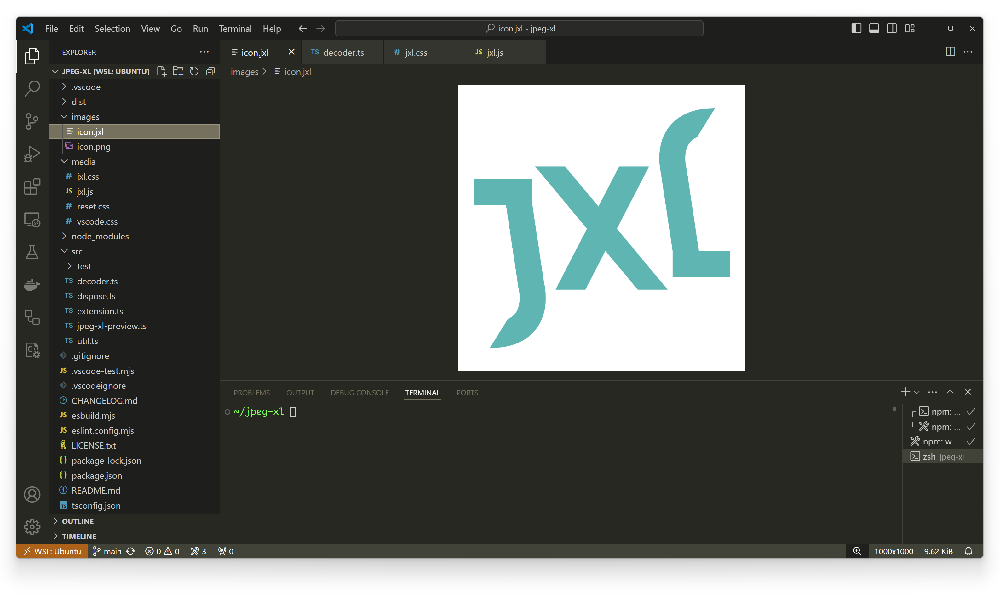

# [JPEG XL for VS Code](https://marketplace.visualstudio.com/items?itemName=printfn.jpeg-xl)

This extension adds [JPEG XL](https://jpegxl.info/) support to VS Code. It lets
you view `.jxl` files directly in your editor.

<picture>
    <source srcset="./images/screenshot.jxl" type="image/jxl">
    <source srcset="./images/screenshot.png" type="image/png">
    
</picture>

You can download this extension from:
* [VS Code Marketplace](https://marketplace.visualstudio.com/items?itemName=printfn.jpeg-xl)
* [OpenVSX (VSCodium)](https://open-vsx.org/extension/printfn/jpeg-xl)
* [GitHub](https://github.com/printfn/jpeg-xl-vscode/releases/latest)

## Features

- View `.jxl` files directly in VS Code, just like built-in image formats like JPEG and PNG
- See the file size and image resolution in the status bar
